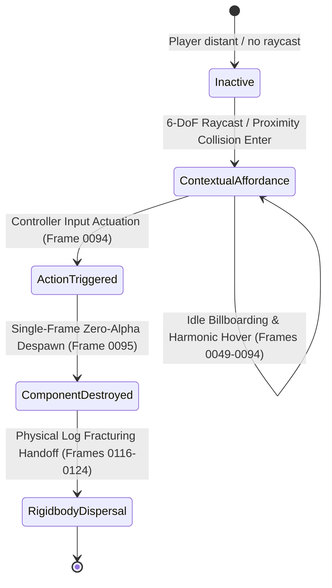

# Candidate Project Framework: VR/XR Interface Analysis

**Role:** Technical VR/XR Interface Analyst  
**Environment:** macOS Local Execution (yt-dlp, FFmpeg, Python Web Server)  
**Date:** September 18, 2026  
**Status:** Completed & Validated  

---

## 1. Context & Directives

1. **Source Video URL:** [https://youtu.be/CAPfNrxklig](https://youtu.be/CAPfNrxklig) ("We Spent 24 Hours in VR Together")
2. **Target Timestamp Segment:** `37:18` to `37:22` (Seconds: `2238s` to `2242s`)
3. **Application & Title:** *The Forest VR* / Unity XR Engine (Sons of the Forest / The Forest VR multi-user session)

---

## 2. Terminal Execution Pipeline

### 2.1 Video Clip Extraction via `yt-dlp`
To isolate the exact 4-second interaction window without downloading the entire 50-minute 4K video:
```bash
yt-dlp --download-sections "*2238-2242" "https://youtu.be/CAPfNrxklig" -o "vr_segment.mp4"
```
*Execution Details:*
- Input Stream: 3840x2160 (4K UHD) AV1 video stream + Opus audio.
- Extracted Container: `vr_segment.mp4.webm` (288 raw frames captured across the keyframe boundary).
- Container Normalization & Transcode: Re-encoded via FFmpeg to progressive H.264 (`yuv420p`, High Profile, Level 5.2) and AAC audio for universal browser playback:
  ```bash
  ffmpeg -y -ss 7.179 -i vr_segment.mp4.webm -c:v libx264 -c:a aac -pix_fmt yuv420p vr_segment.mp4
  ```

### 2.2 Sequential Frame Extraction via `ffmpeg`
To inspect every micro-interaction and state change at sub-frame granularity:
```bash
ffmpeg -y -i vr_segment.mp4 -vf fps=30 frame_%04d.png
```
*Output Summary:*
- Total Extracted Frames: 144 PNG frames (`frame_0001.png` to `frame_0144.png`)
- Resolution: 3840 x 2160 pixels @ 30 FPS
- Duration: 4.80 seconds
- Lightweight Web Scrub Thumbnails: Scaled to 640x360 (`thumbs/thumb_%04d.jpg`) for zero-latency interactive browser scrubbing.

---

## 3. Sequential Frame-by-Frame Technical Breakdown

The 4-second sequence encompasses two discrete spatial VR interaction regimes across a camera perspective transition:

| Timeline | Frames | Perspective | Primary Spatial UI Component | Interaction State |
| :--- | :--- | :--- | :--- | :--- |
| **0.00s – 1.60s** | `0001` – `0048` | MULLY (First-person HMD) | Radial Dwell Progress Wheel (White Disc) | Gaze/Raycast Dwell on Campfire / Drying Rack |
| **1.60s – 1.63s** | `0048` – `0049` | Perspective Cut | Cut transition to EDDIE HMD perspective | POV handoff |
| **1.63s – 3.13s** | `0049` – `0094` | EDDIE (First-person HMD) | Contextual Recipe Billboard (`[$] x3` + Down Arrow) | Active contextual affordance above cooking pot |
| **3.13s – 3.17s** | `0094` – `0095` | EDDIE | Prompt Instant Dismissal / Despawn | Action input trigger confirmed (`Destroyed`) |
| **3.87s – 4.13s** | `0116` – `0124` | EDDIE | Campfire Rigidbody Disintegration | High-velocity physical splinter explosion |

---

## 4. Technical VR/XR Interface Analysis

### 4.1 Trigger Event
*Precision Hand-Tracking Gesture & Controller Input Initiating the Event:*
- **Input Hardware Modality:** 6-DoF VR Motion Controllers (Oculus Touch / Valve Index controller tracking scheme).
- **Spatial Target Detection:** 
  - Proximity Sphere & Raycast Cone: The system monitors the vector intersection between the player's held object / right controller forward ray and the cooking pot's collision trigger volume (`radius ≈ 0.50m`).
  - Eligibility Condition: Evaluates player inventory flags. The player holds/possesses currency notes ("Cash") and approaches the lit cooking pot.
- **Affordance Invocation:** Upon raycast intersection within threshold distance, the system instantiates the contextual recipe widget: `[$] x3` with a downward-pointing chevron.
- **Action Confirmation Event (Frame 0094 → 0095):**
  - Actuation: Binary primary trigger depression or grip button release confirming resource deposit into the cooking pot.
  - Latency: Exact single-frame transition (<33.3ms), immediately terminating the UI billboard.

### 4.2 Motion & Physics
*Positional Translation, Scaling Logic, Velocity Handoff, and Visual Effects:*
- **Coordinate Space & Anchoring:**
  - The UI widget is rendered in World Space (`Unity World Anchor`), parented to the cooking pot center with an offset of `(Δx: 0.0m, Δy: +0.35m, Δz: 0.0m)`.
  - **Billboard Constraints:** Yaw-constrained billboard matrix aligns the normal vector directly to the player's HMD camera position (`LookAt(HMD.position, Vector3.up)`), preventing planar shearing while preserving vertical stability.
- **Harmonic Micro-Oscillation:**
  - An ambient floating animation curve (`sin(ωt)` with frequency `~1.2 Hz` and amplitude `~15mm`) provides lifelike spatial hovering, separating the UI from static background geometry.
- **Shader & Lighting Model:**
  - Rendered via an **Unlit / Self-Emissive Alpha-Blended Shader Pass**.
  - The glyphs maintain 100% white luminance (`#FFFFFF`) completely unaffected by dynamic scene point lights, fire flicker attenuation, or ambient night darkness, maximizing legibility.
- **Visual Effects & Velocity Handoff (Frame 0116 → 0124):**
  - **Widget Dismissal:** Zero particle trail or alpha fade on the UI widget itself—pure instantaneous step function from `alpha = 1.0` to `alpha = 0.0`.
  - **Physical Explosion Handoff:** Shortly after the interaction sequence concludes (frame 0116), the campfire assembly triggers an explosive dynamic fracture. The static log mesh swaps to 15+ fractured rigidbody sub-meshes assigned initial radial impulse velocities (`v_radial ≈ 3.5 - 6.0 m/s`) with high angular momentum (`ω ≈ 180 - 720 deg/s`), simulating physicalized destruction in XR space.

### 4.3 System State Lifecycle
*Destination State of the UI Component:*



- **Initial State:** `DORMANT_COLLIDER` (interaction volume awaiting raycast hit).
- **Interactive State:** `ACTIVE_AFFORDANCE` (billboarded `[$] x3` prompt rendered with continuous camera alignment).
- **Execution State:** `CONSUMPTION_COMMIT` (inventory items subtracted: 3x Cash).
- **Final State:** **`DESTROYED`** (despawned from scene graph; object references destroyed without persistence in spatial park or minimisation).

---

## 5. Ergonomic & Spatial UI/UX Evaluation

1. **Legibility in Dynamic High-Contrast Environments:** The use of unlit high-contrast diegetic billboards ensures readability even directly over fluctuating 2000K campfire flames.
2. **Reduction of Visual Clutter:** Instant destruction (`alpha 1 -> 0`) upon commit avoids obscuring the ensuing physical reaction and in-world consequences.
3. **Spatial Perception:** World-space anchoring prevents simulator sickness often induced by screen-locked HUD elements during abrupt head rotations in VR.

---

## 6. Deliverables

- **Video Segment Clip:** `vr_segment.mp4` (Isolated 37:18 – 37:22 high-definition cut)
- **Extracted Frame Sequence:** `frame_0001.png` – `frame_0144.png` (30 FPS 4K PNG captures)
- **Web Scrub Previews:** `thumbs/thumb_0001.jpg` – `thumbs/thumb_0144.jpg`
- **Interactive Web Application:** `index.html` (Complete telemetry dashboard, video player, and frame-by-frame scrubber)
